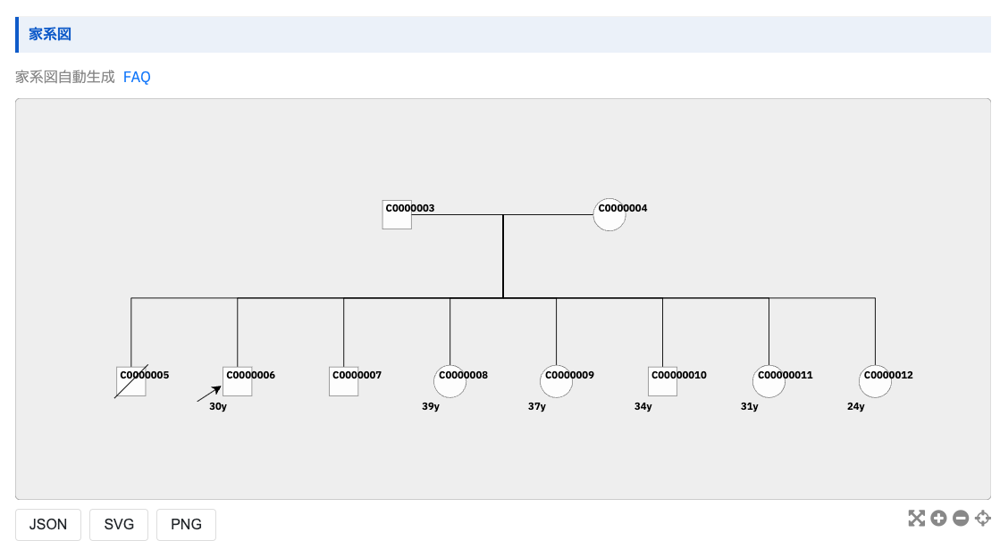

# 家系

家系のページでは、患者の家族に関する重要な情報を管理します。 
この情報は、遺伝性疾患の診断や、家族性のリスク評価に不可欠です。 
患者の遺伝的背景を理解し、適切な遺伝カウンセリングや予防策を提供するための基礎となります。

## 大項目

| 項目名                                     | 説明                                                                                                               |
| ------------------------------------------ | ------------------------------------------------------------------------------------------------------------------ |
| **[家族歴](#family-history)**              | 家族歴に関する情報を編集することができます。                                                                       |
| **[遺伝形式](#mode-of-inheritance)**       | 遺伝形式に関する情報を編集することができます。                                                                     |
| **[親族（がん・生活習慣病）](#relatives)** | 親族（がん・生活習慣病）に関する情報を編集することができます。 親族（がん・生活習慣病）は複数登録が可能です。 |
| **[民族](#ethnicity)**                     | 民族に関する情報を編集することができます。                                                                         |
| **[近親婚](#consanguinity)**               | 近親婚に関する情報を編集することができます。                                                                       |
| **[家系図](#pedigree)**                    | 家系図に関する情報を編集することができます。 症例基本情報や診療で入力した情報をもとに家系図を自動生成します。 |

---

## 家族歴 {: #family-history}

<table>
  <thead>
    <tr>
      <th rowspan="2">項目名</th>
      <th rowspan="2">ID</th>
      <th rowspan="2">型定義</th>
      <th rowspan="2">入力形式</th>
      <th colspan="2">選択肢</th>
      <th rowspan="2">初期値</th>
      <th rowspan="2">clearボタン</th>
      <th rowspan="2">deleteボタン</th>
      <th rowspan="2">Phenopackets</th>
      <th rowspan="2">備考</th>
    </tr>
    <tr>
      <th>値</th>
      <th>ラベル</th>
    </tr>
  </thead>
  <tbody>
    <tr>
      <td><strong>家族歴</strong></td>
      <td>family_history</td>
      <td>string</td>
      <td>テキストエリア</td>
      <td>-</td>
      <td>-</td>
      <td>null</td>
      <td><input type="checkbox" class="readonly-input" /></td>
      <td><input type="checkbox" class="readonly-input" /></td>
      <td></td>
      <td></td>
    </tr>
    <tr>
      <td><strong>家族内発症の有無</strong></td>
      <td>family_presence_of_onset_in_family</td>
      <td>string</td>
      <td>ラジオボタン</td>
      <td>
        <ul>
          <li>unknown</li>
          <li>absent</li>
          <li>present</li>
        </ul>
      </td>
      <td>
        <ul>
          <li>不明</li>
          <li>なし</li>
          <li>あり</li>
        </ul>
      </td>
      <td>"unknown"</td>
      <td><input type="checkbox" class="readonly-input" checked /></td>
      <td><input type="checkbox" class="readonly-input" /></td>
      <td></td>
      <td></td>
    </tr>
    <tr>
      <td><strong>その他の罹患近親者</strong></td>
      <td>family_other_affected_relatives</td>
      <td>string</td>
      <td>ラジオボタン</td>
      <td>
        <ul>
          <li>unknown</li>
          <li>absent</li>
          <li>present</li>
        </ul>
      </td>
      <td>
        <ul>
          <li>不明</li>
          <li>なし</li>
          <li>あり</li>
        </ul>
      </td>
      <td>"unknown"</td>
      <td><input type="checkbox" class="readonly-input" checked /></td>
      <td><input type="checkbox" class="readonly-input" /></td>
      <td></td>
      <td></td>
    </tr>
    <tr>
      <td><strong>母親の死産・流産の有無</strong></td>
      <td>family_presence_of_miscarriage_or_stillbirth_of_mother</td>
      <td>string</td>
      <td>ラジオボタン</td>
      <td>
        <ul>
          <li>unknown</li>
          <li>absent</li>
          <li>present</li>
        </ul>
      </td>
      <td>
        <ul>
          <li>不明</li>
          <li>なし</li>
          <li>あり</li>
        </ul>
      </td>
      <td>"unknown"</td>
      <td><input type="checkbox" class="readonly-input" checked /></td>
      <td><input type="checkbox" class="readonly-input" /></td>
      <td></td>
      <td></td>
    </tr>
    <tr>
      <td><strong>死産の回数</strong></td>
      <td>family_number_of_stillbirth_of_mother</td>
      <td>string</td>
      <td>テキストボックス (数字)</td>
      <td>-</td>
      <td>-</td>
      <td>"unknown"</td>
      <td><input type="checkbox" class="readonly-input" /></td>
      <td><input type="checkbox" class="readonly-input" /></td>
      <td></td>
      <td>母親の死産・流産の有無で「あり」を選択している時のみ入力可（それ以外の場合は非活性）</td>
    </tr>
    <tr>
      <td><strong>流産 (自然) の回数</strong></td>
      <td>family_number_of_miscarriage_of_mother</td>
      <td>string</td>
      <td>テキストボックス (数字)</td>
      <td>-</td>
      <td>-</td>
      <td>"unknown"</td>
      <td><input type="checkbox" class="readonly-input" /></td>
      <td><input type="checkbox" class="readonly-input" /></td>
      <td></td>
      <td>母親の死産・流産の有無で「あり」を選択している時のみ入力可（それ以外の場合は非活性）</td>
    </tr>
    <tr>
      <td><strong>流産 (人工) の回数</strong></td>
      <td>family_number_of_artificial_abortion_of_mother</td>
      <td>string</td>
      <td>テキストボックス (数字)</td>
      <td>-</td>
      <td>-</td>
      <td>"unknown"</td>
      <td><input type="checkbox" class="readonly-input" /></td>
      <td><input type="checkbox" class="readonly-input" /></td>
      <td></td>
      <td>母親の死産・流産の有無で「あり」を選択している時のみ入力可（それ以外の場合は非活性）</td>
    </tr>
  </tbody>
</table>

## 遺伝形式 {: #mode-of-inheritance}

<table>
  <thead>
    <tr>
      <th rowspan="2">項目名</th>
      <th rowspan="2">ID</th>
      <th rowspan="2">型定義</th>
      <th rowspan="2">入力形式</th>
      <th colspan="2">選択肢</th>
      <th rowspan="2">初期値</th>
      <th rowspan="2">clearボタン</th>
      <th rowspan="2">deleteボタン</th>
      <th rowspan="2">Phenopackets</th>
      <th rowspan="2">備考</th>
    </tr>
    <tr>
      <th>値</th>
      <th>ラベル</th>
    </tr>
  </thead>
  <tbody>
    <tr>
      <td><strong>遺伝形式</strong></td>
      <td>family_mode_inheritance</td>
      <td>string | null</td>
      <td>ラジオボタン（階層あり）</td>
      <td>
        <ul>
          <li>Sporadic</li>
          <li>Autosomal dominant inheritance</li>
          <li>Sex-limited autosomal dominant</li>
          <li>Autosomal dominant somatic cell mutation</li>
          <li>Autosomal dominant contiguous gene syndrome</li>
          <li>Autosomal recessive inheritance</li>
          <li>
            Gonosomal inheritance
            <ul>
              <li>X-linked inheritance</li>
              <li>X-linked dominant inheritance</li>
              <li>X-linked recessive inheritance</li>
              <li>Y-linked inheritance</li>
            </ul>
          </li>
          <li>
            Multifactorial inheritance
            <ul>
              <li>Digenic inheritance</li>
              <li>Oligogenic inheritance</li>
              <li>Polygenic inheritance</li>
            </ul>
          </li>
          <li>Mitochondrial inheritance</li>
        </ul>
      </td>
      <td>
        <ul>
          <li>Sporadic</li>
          <li>Autosomal dominant inheritance</li>
          <li>Sex-limited autosomal dominant</li>
          <li>Autosomal dominant somatic cell mutation</li>
          <li>Autosomal dominant contiguous gene syndrome</li>
          <li>Autosomal recessive inheritance</li>
          <li>
            Gonosomal inheritance
            <ul>
              <li>X-linked inheritance</li>
              <li>X-linked dominant inheritance</li>
              <li>X-linked recessive inheritance</li>
              <li>Y-linked inheritance</li>
            </ul>
          </li>
          <li>
            Multifactorial inheritance
            <ul>
              <li>Digenic inheritance</li>
              <li>Oligogenic inheritance</li>
              <li>Polygenic inheritance</li>
            </ul>
          </li>
          <li>Mitochondrial inheritance</li>
        </ul>
      </td>
      <td>null</td>
      <td><input type="checkbox" class="readonly-input" checked /></td>
      <td><input type="checkbox" class="readonly-input" /></td>
      <td></td>
      <td></td>
    </tr>
  </tbody>
</table>

## 親族（がん・生活習慣病） {: #relatives}
- 下記を1つの親族（がん・生活習慣病）の項目群とし、複数の親族情報を登録可能
    - 各項目のデータは親族の登録数分の配列
        - 例）1つ目の親族は各項目の配列の0番目
- 親族はボタン操作で「追加」「削除」が可能
    - 「削除」ボタン押下時は下記文言の確認アラートを表示し、「OK」押下時のみ実行
        - 「削除しますか？」
<table>
  <thead>
    <tr>
      <th rowspan="2">中項目名</th>
      <th rowspan="2">項目名</th>
      <th rowspan="2">ID</th>
      <th rowspan="2">型定義</th>
      <th rowspan="2">入力形式</th>
      <th colspan="2">選択肢</th>
      <th rowspan="2">初期値</th>
      <th rowspan="2">clearボタン</th>
      <th rowspan="2">deleteボタン</th>
      <th rowspan="2">Phenopackets</th>
      <th rowspan="2">備考</th>
    </tr>
    <tr>
      <th>値</th>
      <th>ラベル</th>
    </tr>
  </thead>
  <tbody>
    <tr>
      <td></td>
      <td><strong>親族名称</strong></td>
      <td>family_relative_name</td>
      <td>Array&lt;string|null&gt;</td>
      <td>セレクトボックス</td>
      <td>
        <ul>
          <li>father</li>
          <li>mother</li>
          <li>parent_unknown</li>
          <li>sibling</li>
          <li>child</li>
          <li>grandparent_paternal</li>
          <li>grandparent_maternal</li>
          <li>grandparent_unknown</li>
          <li>uncle_paternal</li>
          <li>uncle_maternal</li>
          <li>aunt_paternal</li>
          <li>aunt_maternal</li>
        </ul>
      </td>
      <td>
        <ul>
          <li>父</li>
          <li>母</li>
          <li>親（詳細不明）</li>
          <li>同胞</li>
          <li>子ども</li>
          <li>祖父母（父方）</li>
          <li>祖父母（母方）</li>
          <li>祖父母（詳細不明）</li>
          <li>おじ（父方）</li>
          <li>おじ（母方）</li>
          <li>おば（父方）</li>
          <li>おば（母方）</li>
        </ul>
      </td>
      <td>[]</td>
      <td><input type="checkbox" class="readonly-input" /></td>
      <td><input type="checkbox" class="readonly-input" /></td>
      <td></td>
      <td></td>
    </tr>
    <tr>
      <td></td>
      <td><strong>家系図における世代番号 (親族)</strong></td>
      <td>family_generation_number_of_relative</td>
      <td>Array&lt;string|null&gt;</td>
      <td>テキストボックス</td>
      <td>-</td>
      <td>-</td>
      <td>[]</td>
      <td><input type="checkbox" class="readonly-input" /></td>
      <td><input type="checkbox" class="readonly-input" /></td>
      <td></td>
      <td></td>
    </tr>
    <tr>
      <td></td>
      <td><strong>遺伝性がん検査実施の有無</strong></td>
      <td>family_presence_of_genetic_cancer_testing</td>
      <td>Array&lt;string|null&gt;</td>
      <td>ラジオボタン</td>
      <td>
        <ul>
          <li>unknown</li>
          <li>absent</li>
          <li>present</li>
        </ul>
      </td>
      <td>
        <ul>
          <li>不明</li>
          <li>なし</li>
          <li>あり</li>
        </ul>
      </td>
      <td>[]</td>
      <td><input type="checkbox" class="readonly-input" checked /></td>
      <td><input type="checkbox" class="readonly-input" /></td>
      <td></td>
      <td></td>
    </tr>
    <tr>
      <td></td>
      <td><strong>遺伝性がん検査の結果ファイル</strong></td>
      <td>family_genetic_cancer_testing_result_file</td>
      <td>Array&lt;string|null&gt;</td>
      <td>テキストボックス</td>
      <td>-</td>
      <td>-</td>
      <td>[]</td>
      <td><input type="checkbox" class="readonly-input" /></td>
      <td><input type="checkbox" class="readonly-input" /></td>
      <td></td>
      <td>遺伝性がん検査実施の有無で「あり」を選択している時のみ入力可（それ以外の場合は非活性）</td>
    </tr>
    <tr>
      <td></td>
      <td><strong>がん罹患歴の有無</strong></td>
      <td>family_presence_of_cancer_history</td>
      <td>Array&lt;string|null&gt;</td>
      <td>ラジオボタン</td>
      <td>
        <ul>
          <li>unknown</li>
          <li>absent</li>
          <li>present</li>
        </ul>
      </td>
      <td>
        <ul>
          <li>不明</li>
          <li>なし</li>
          <li>あり</li>
        </ul>
      </td>
      <td>[]</td>
      <td><input type="checkbox" class="readonly-input" checked /></td>
      <td><input type="checkbox" class="readonly-input" /></td>
      <td></td>
      <td></td>
    </tr>
    <tr>
      <td rowspan="3"><strong>がん罹患歴詳細</strong></td>
      <td><strong>がん種</strong></td>
      <td>family_cancer_history_cancer_type</td>
      <td>Array&lt;Array&lt;string|null&gt;&gt;</td>
      <td>セレクトボックス</td>
      <td>リンクはる</td>
      <td>リンクはる</td>
      <td>[]</td>
      <td><input type="checkbox" class="readonly-input" /></td>
      <td><input type="checkbox" class="readonly-input" /></td>
      <td></td>
      <td rowspan="3">
        追加ボタンから項目を増やすことが可能。各キーには配列として保存される 
        「その他詳細」はがん腫で「その他」を選択している時のみ入力可（それ以外の場合は非活性）
      </td>
    </tr>
    <tr>
      <td><strong>その他詳細</strong></td>
      <td>family_cancer_history_cancer_type_other_details</td>
      <td>Array&lt;Array&lt;string|null&gt;&gt;</td>
      <td>テキストボックス</td>
      <td>-</td>
      <td>-</td>
      <td>[]</td>
      <td><input type="checkbox" class="readonly-input" /></td>
      <td><input type="checkbox" class="readonly-input" /></td>
      <td></td>
    </tr>
    <tr>
      <td><strong>罹患年齢</strong></td>
      <td>family_cancer_history_age_of_onset</td>
      <td>Array&lt;Array&lt;string|null&gt;&gt;</td>
      <td>ラジオボタン</td>
      <td>
        <ul>
          <li>unknown</li>
          <li>under_10_years_old</li>
          <li>10s</li>
          <li>20s</li>
          <li>30s</li>
          <li>40s</li>
          <li>50s</li>
          <li>60s</li>
          <li>70s</li>
          <li>80s</li>
          <li>90_and_above</li>
        </ul>
      </td>
      <td>
        <ul>
          <li>不明</li>
          <li>10歳未満</li>
          <li>10歳台</li>
          <li>20歳台</li>
          <li>30歳台</li>
          <li>40歳台</li>
          <li>50歳台</li>
          <li>60歳台</li>
          <li>70歳台</li>
          <li>80歳台</li>
          <li>90歳以上</li>
        </ul>
      </td>
      <td>[]</td>
      <td><input type="checkbox" class="readonly-input" checked /></td>
      <td><input type="checkbox" class="readonly-input" /></td>
      <td></td>
    </tr>
    <tr>
      <td><strong>生活習慣病罹患歴の有無</strong></td>
      <td>family_presence_of_lifestyle_disease_history</td>
      <td>Array&lt;string|null&gt;</td>
      <td>ラジオボタン</td>
      <td>
        <ul>
          <li>unknown</li>
          <li>absent</li>
          <li>present</li>
        </ul>
      </td>
      <td>
        <ul>
          <li>不明</li>
          <li>なし</li>
          <li>あり</li>
        </ul>
      </td>
      <td>[]</td>
      <td><input type="checkbox" class="readonly-input" checked /></td>
      <td><input type="checkbox" class="readonly-input" /></td>
      <td></td>
      <td></td>
    </tr>
    <tr>
      <td><strong>生活習慣病罹患歴詳細</strong></td>
      <td>family_lifestyle_disease_history</td>
      <td>Array&lt;Array&lt;string|null&gt;&gt;</td>
      <td>チェックボックス</td>
      <td>
        <ul>
          <li>unknown</li>
          <li>hypertension</li>
          <li>type_2_diabetes</li>
          <li>obesity_metabolic_syndrome</li>
          <li>chronic_obstructive_pulmonary_disease</li>
          <li>dyslipidemia</li>
          <li>hyperuricemia</li>
          <li>circulatory_disease</li>
          <li>other</li>
        </ul>
      </td>
      <td>
        <ul>
          <li>不明</li>
          <li>高血圧</li>
          <li>2型糖尿病</li>
          <li>肥満症/メタボリックシンドローム</li>
          <li>慢性閉塞性肺疾患（COPD）</li>
          <li>糖質異常症</li>
          <li>高尿酸血症</li>
          <li>循環器病（先天性のものを除く）</li>
          <li>その他</li>
        </ul>
      </td>
      <td>[]</td>
      <td><input type="checkbox" class="readonly-input" /></td>
      <td><input type="checkbox" class="readonly-input" /></td>
      <td></td>
      <td></td>
    </tr>
    <tr>
      <td><strong>その他詳細</strong></td>
      <td>family_lifestyle_disease_history_other_details</td>
      <td>Array&lt;string|null&gt;</td>
      <td>テキストボックス</td>
      <td>-</td>
      <td>-</td>
      <td>[]</td>
      <td><input type="checkbox" class="readonly-input" /></td>
      <td><input type="checkbox" class="readonly-input" /></td>
      <td></td>
      <td>生活習慣病罹患歴詳細で「その他」を選択している時のみ入力可（それ以外の場合は非活性）</td>
    </tr>
  </tbody>
</table>

## 民族 {: #ethnicity}

<table>
  <thead>
    <tr>
      <th rowspan="2">項目名</th>
      <th rowspan="2">ID</th>
      <th rowspan="2">型定義</th>
      <th rowspan="2">入力形式</th>
      <th colspan="2">選択肢</th>
      <th rowspan="2">初期値</th>
      <th rowspan="2">clearボタン</th>
      <th rowspan="2">deleteボタン</th>
      <th rowspan="2">Phenopackets</th>
      <th rowspan="2">備考</th>
    </tr>
    <tr>
      <th>値</th>
      <th>ラベル</th>
    </tr>
  </thead>
  <tbody>
    <tr>
      <td><strong>父方の民族</strong></td>
      <td>family_paternal_ethnicity</td>
      <td>string | null</td>
      <td>テキストボックス</td>
      <td>-</td>
      <td>-</td>
      <td>null</td>
      <td><input type="checkbox" class="readonly-input" /></td>
      <td><input type="checkbox" class="readonly-input" /></td>
      <td></td>
      <td></td>
    </tr>
    <tr>
      <td><strong>母方の民族</strong></td>
      <td>family_maternal_ethnicity</td>
      <td>string | null</td>
      <td>テキストボックス</td>
      <td>-</td>
      <td>-</td>
      <td>null</td>
      <td><input type="checkbox" class="readonly-input" /></td>
      <td><input type="checkbox" class="readonly-input" /></td>
      <td></td>
      <td></td>
    </tr>
  </tbody>
</table>

## 近親婚 {: #consanguinity}

<table>
  <thead>
    <tr>
      <th rowspan="2">項目名</th>
      <th rowspan="2">ID</th>
      <th rowspan="2">型定義</th>
      <th rowspan="2">入力形式</th>
      <th colspan="2">選択肢</th>
      <th rowspan="2">初期値</th>
      <th rowspan="2">clearボタン</th>
      <th rowspan="2">deleteボタン</th>
      <th rowspan="2">Phenopackets</th>
      <th rowspan="2">備考</th>
    </tr>
    <tr>
      <th>値</th>
      <th>ラベル</th>
    </tr>
  </thead>
  <tbody>
    <tr>
      <td><strong>近親婚（本人）</strong></td>
      <td>family_consanguinity</td>
      <td>string</td>
      <td>ラジオボタン</td>
      <td>
        <ul>
          <li>unknown</li>
          <li>absent</li>
          <li>present</li>
        </ul>
      </td>
      <td>
        <ul>
          <li>不明</li>
          <li>なし</li>
          <li>あり</li>
        </ul>
      </td>
      <td>"unknown"</td>
      <td><input type="checkbox" class="readonly-input" checked /></td>
      <td><input type="checkbox" class="readonly-input" /></td>
      <td></td>
      <td></td>
    </tr>
    <tr>
      <td><strong>近親婚(患者両親)</strong></td>
      <td>family_consanguinity_of_parents</td>
      <td>string</td>
      <td>ラジオボタン</td>
      <td>
        <ul>
          <li>unknown</li>
          <li>absent</li>
          <li>present</li>
        </ul>
      </td>
      <td>
        <ul>
          <li>不明</li>
          <li>なし</li>
          <li>あり</li>
        </ul>
      </td>
      <td>"unknown"</td>
      <td><input type="checkbox" class="readonly-input" checked /></td>
      <td><input type="checkbox" class="readonly-input" /></td>
      <td></td>
      <td></td>
    </tr>
  </tbody>
</table>

## 家系図 {: #pedigree}

- 家系図には[pedigreejs](https://ccge-boadicea.github.io/pedigreejs/)を使用しています
  - 2024 年 8 月現在、使用バージョンは`3.0.0`

下記を正しく設定することで家系図が自動生成できます

| 家系図生成用データキー | 症例データの参照キー                                                       | ラベル                                     |
| ---------------------- | -------------------------------------------------------------------------- | ------------------------------------------ |
| name                   | PCFNo 　                                                                   | 症例基本情報 > ID > PCF No.                |
| display_name           | case_id 　                                                                 | 症例基本情報 > ID > 症例 ID                |
| sex                    | case_sex 　                                                                | 症例基本情報 > 基本情報 > 性別             |
| age                    | case_age YMD 形式の年齢（Y）　                                             | 症例基本情報 > 基本情報 > 登録時年齢 (YMD) |
| status                 | case_life_status 　                                                        | 症例基本情報 > 基本情報 > 状態             |
| relationship           | case_relationship 　                                                       | 症例基本情報 > 基本情報 > 続柄             |
| spouse_id              | case_spouse_id 　                                                          |                                            |
| parent_id              | case_parent_id 　                                                          |                                            |
| diagnosis              | medical_final_diagnosis_name 　                                            | 診療 > 診断 > 確定診断 > 疾患名            |
| father                 | relationship を元に PCFNo を格納　                                         |                                            |
| mother                 | relationship を元に PCFNo を格納　                                         |                                            |
| top_level              | father,mother,children を元に家系図のトップに位置するかを boolean で設定　 |                                            |

### ダウンロード

JSON,SVG,PNG 形式で生成した家系図をダウンロードできます。

### エラーメッセージ表示条件

| 条件 | エラーメッセージ |
| --- | --- |
| 家系に発端者（本人）が一人もいない場合 | 家系に発端者（本人）がいないため、家系図を生成できません。 |
| 家系に発端者（本人）が複数いる場合 | 家系に複数の発端者（本人）がいるため、家系図を生成できません。 |
| 家系に同性の親がいる場合 | 家系に同性の親がいるため、家系図を生成できません。 |
| 子供の配偶者に孫がいない場合 | <症例ID>は子どものいない配偶者です。家系図上では描画されません。 |
| その他想定外のエラー | 家系図の表示に失敗しました。FAQを確認してください。 |
