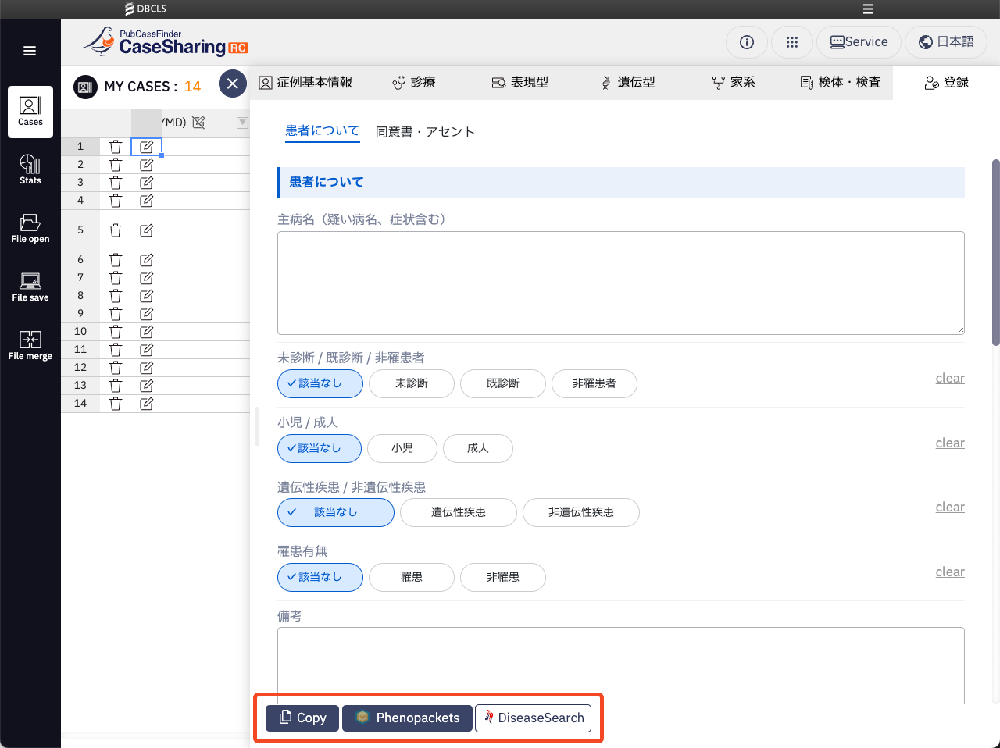

# 編集モーダルフッター

編集モーダルフッターにある各ボタンの機能についての説明です。

## 症例のコピー {: #copy}

現在編集中の症例をコピーすることができます。ボタン押下で一覧表の一番下に症例のコピーが追加されます。
PCF No.以外全てのデータがコピーされます。

## Phenopackets {: #phenopackets}

[症例基本情報](cases/edit/case-basic-information)の基本情報>続柄で「発端者（本人）」が選択された状態だと、現在編集集の症例をPhenopacketsのフォーマットに変換したデータをyaml形式でダウンロードすることができます。
Phenopacketsについては以下をご確認ください。

- [公式サイト](http://phenopackets.org/)
- [ドキュメント](https://phenopacket-schema.readthedocs.io/en/latest/index.html)

## DiseaseSearch {: #diseaseSearch}

[表現型タブ](cases/edit/phenotype)で臨床症状を入力すると、[pubcasefinder](https://pubcasefinder.dbcls.jp/)で入力した症状を検索することができます。
ボタン押下で別タブが開き、pubcasefinderの検索結果画面が表示されます。