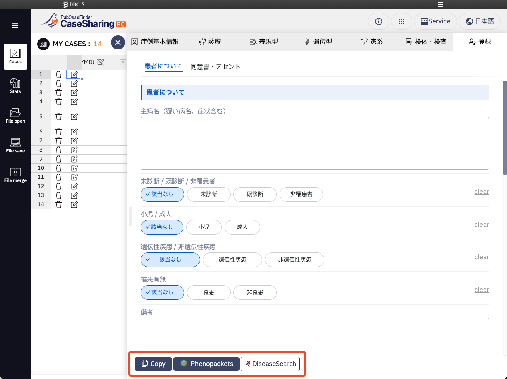

# 編集モーダルフッター

編集モーダルフッターにある各ボタンの機能についての説明です。 

## 症例のコピー {: #copy}

現在編集中の症例をコピーすることができます。ボタン押下で一覧表の一番下に症例のコピーが追加されます。以下の項目以外全てのデータがコピーされます。

- case_updated_at
- PCF No.

 

## Phenopackets {: #phenopackets}

### ダウンロード

[症例基本情報](cases/edit/case-basic-information)の基本情報>続柄で「発端者（本人）」が選択された状態だと、現在編集中の症例をPhenopacketsのフォーマットに変換したデータをjson、またはyaml形式でダウンロードすることができます。

### Phenopacket⇄CaseSharing

以下はPhenopacket⇄CaseSharingの項目の対応表です。

- **Phenopacket**欄と**CaseSharing**欄には、それぞれの形式で使用されている項目の「キー名（key）」を記載しています。
- **CaseSharing項目名**は、CaseSharingにおけるその項目の日本語ラベルを示しています。
- **メモ欄**には、各項目の補足情報や注意点を記載しています。

表中のPhenopacket欄における**太字の項目名**（例：subject、subject.timeAtLastEncounter）は、オブジェクトの親要素を表しており、それ自体は値を持ちません。
その下に続く subject.id や subject.sex のような項目が、親オブジェクトに含まれる末端のプロパティです。
一方、通常の太さの項目名（例：subject.sex）は、実際に値を持つ末端のデータ項目を意味しています。
黄色くハイライトしているセルは、紐付け未対応のセルです。今後CaseSharingにUI追加し、紐付けする想定です。

<iframe
  src="https://docs.google.com/spreadsheets/d/e/2PACX-1vRBkJbezbx8lYZ-1R6rCMggGlr8Dyddgxq-c0GX2v6X03elKZgWr9Ga4o2OWrpAmY4cw7q_0JOCuSCp/pubhtml?gid=824969734&amp;single=true&amp;widget=true&amp;headers=false"
  width="100%"
  height="800px"
></iframe>

### 公式ドキュメント

Phenopackets自体の仕様については以下をご確認ください。

- [公式サイト](http://phenopackets.org/)
- [ドキュメント](https://phenopacket-schema.readthedocs.io/en/latest/index.html)

## DiseaseSearch {: #diseaseSearch}

[表現型タブ](cases/edit/phenotype)で臨床症状を入力すると、[pubcasefinder](https://pubcasefinder.dbcls.jp/)で入力した症状を検索することができます。
ボタン押下で別タブが開き、pubcasefinderの検索結果画面が表示されます。