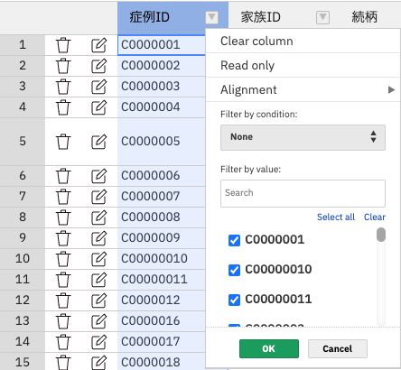

# 列の操作

一覧表のヘッダーの右に配置されている三角ボタンを押下した際にドロップダウンメニューが表示される。

このドロップダウンメニューから下記の列の各操作が可能。

- `Clear column`
    - 現在表示中の列の値をすべて空にする
    - フィルターを適用している場合は、フィルターによって非表示となっている値は空にしない
- `Read only`
    - 現在表示中の列の値をすべて編集不可にする
    - フィルターを適用している場合は、フィルターによって非表示となっている値は編集不可にしない
- `Alignment`
    - 現在表示中の列の値をすべて配置変更する
    - フィルターを適用している場合は、フィルターによって非表示となっている値は配置変更しない
- `Filter by condition`
    - データのフィルターが可能
    - 項目のデータ種別によって使用可能な選択肢は下記参照
    - [Handsontable Guides > Column filter > Filter different types of data](https://handsontable.com/docs/12.3/javascript-data-grid/column-filter/#filter-different-types-of-data)
- `Filter by value`
    - チェックボックスの選択肢を値で絞り込む
    - チェックボックスの選択有無でフィルターがかかる為、値を絞り込むだけでは一覧表のフィルターにはならない
- `チェックボックス`
    - 選択しているもののみでフィルターをかける
    - `Select all`
        - 現在表示中のチェックボックスをすべて選択する
    - `Clear`
        - 現在表示中のチェックボックスをすべて外す