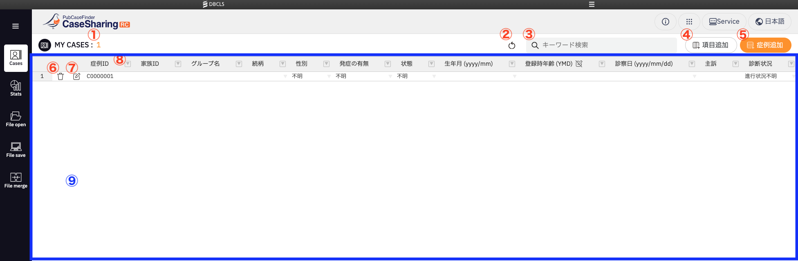

# 画面仕様

- 一覧表には[Handsontable](https://handsontable.com/)を使用
    - 2024年12月現在、使用バージョンは`14.6.1`

 

<table>
  <thead>
    <tr>
      <th>番号</th>
      <th>機能</th>
      <th>詳細</th>
    </tr>
  </thead>
  <tbody>
    <tr>
      <td>1</td>
      <td>表の症例数</td>
      <td>症例数の更新に応じて自動で表示数を更新</td>
    </tr>
    <tr>
      <td>2</td>
      <td>リロード</td>
      <td>ブラウザ固有の確認アラートを表示し、「OK」押下時のみページのリロードを行う リロード後は一覧表の内容は初期化</td>
    </tr>
    <tr>
      <td>3</td>
      <td><a href="../operations/search-keyword">キーワード検索</a></td>
      <td>入力したキーワードを含む症例を絞り込む</td>
    </tr>
    <tr>
      <td>4</td>
      <td><a href="../operations/add-items">項目追加</a></td>
      <td>項目の編集ドロップダウンを開く 項目の新規作成、表示項目の追加や削除が可能</td>
    </tr>
    <tr>
      <td>5</td>
      <td><a href="../operations/add-case">症例追加</a></td>
      <td>一覧表の後ろに症例を追加</td>
    </tr>
    <tr>
      <td>6</td>
      <td>症例削除</td>
      <td>下記文言の確認アラートを表示し、「OK」押下時のみ実行 「症例ID {caseId} を削除しますか？」</td>
    </tr>
    <tr>
      <td>7</td>
      <td>症例編集</td>
      <td>
        症例の編集モーダルが開く 
        各項目の編集内容詳細は下記参照 
        <ul>
          <li><a href="../edit/case-basic-information">症例基本情報</a></li>
          <li><a href="../edit/medical">診療</a></li>
          <li><a href="../edit/phenotype">表現型</a></li>
          <li><a href="../edit/genotype">遺伝型</a></li>
          <li><a href="../edit/family-info">家系</a></li>
          <li><a href="../edit/sample-info">検体・検査</a></li>
          <li><a href="../edit/registration">登録</a></li>
        </ul>
      </td>
    </tr>
    <tr>
      <td>8</td>
      <td><a href="../operations/operation-column">列の操作</a></td>
      <td>列の操作一覧が開く 列のデータの一括操作やフィルターをかけることが可能</td>
    </tr>
    <tr>
      <td>9</td>
      <td>File open</td>
      <td>
        枠内にファイルをドラッグ&ドロップすることでデータファイルを取り込み 
        編集モーダルを開いている場合はドラッグ&ドロップしてもデータファイルの取り込みは不可 
        File openの仕様詳細は<a href="../../file-open/specifications">こちら</a>を参照
      </td>
    </tr>
    <tr>
      <td>-</td>
      <td>列の移動</td>
      <td>
        ヘッダ部分をドラッグ&ドロップで列の順序を変更する 
        症例削除ボタンのある1列目、症例編集ボタンのある2列目は変更不可
      </td>
    </tr>
    <tr>
      <td>-</td>
      <td>列のサイズ変更</td>
      <td>ヘッダ部分の列の間を移動することで列の幅を変更する</td>
    </tr>
    <tr>
      <td>-</td>
      <td>列の並べ替え</td>
      <td>ヘッダの項目名を押下することで昇順、降順、並べ替えなしの順で列を並び替える</td>
    </tr>
    <tr>
      <td>-</td>
      <td>行の移動</td>
      <td>ヘッダ部分をドラッグ&ドロップで行の順序を変更する</td>
    </tr>
    <tr>
      <td>-</td>
      <td>右クリックメニュー</td>
      <td>
        ヘッダ、行番号、セル上で右クリックすることで開くメニューで下記機能が使用可能 
        <ul>
          <li>
            Alignment
            <ul><li>配置変更する</li></ul>
          </li>
          <li>
            Cut
            <ul><li>選択した列や行、セルの内容をシステムクリップボードに切り取る</li></ul>
          </li>
          <li>
            Copy
            <ul><li>選択した列や行、セルの内容をシステムクリップボードにコピーする</li></ul>
          </li>
        </ul>
      </td>
    </tr>
    <tr>
      <td>-</td>
      <td>フィルハンドル</td>
      <td>
        セルの右下の小さな四角をドラッグし、選択したセルの値を隣接するセルにコピーする 
        行、列どちらも使用可能
      </td>
    </tr>
  </tbody>
</table>