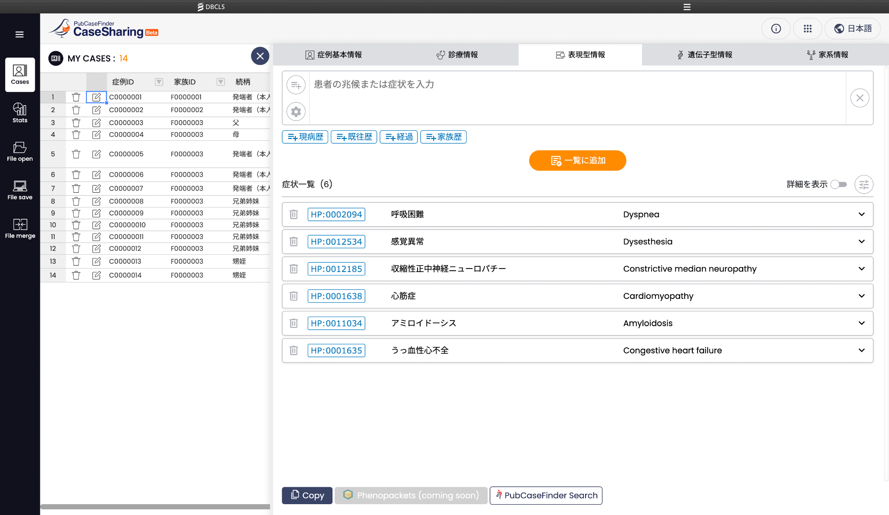

<h1 style="color: #ff2335;">※ 当サイトは開発中につき、サイトの内容について実際の仕様とは異なる場合があります。</h1>

---

# CaseSharing Spec のドキュメントへようこそ！

## CaseSharing について

CaseSharing は、ユーザ自身で集積した希少疾患・遺伝性疾患の症例情報を登録し、管理するための機能です（図 2）。希少・遺伝性疾患の症例情報は、診断・治療・創薬などの研究に欠かせないリソースですが、症例自体が希少であり、多施設でそれらを継続的に集積する必要があり、将来的には一箇所に集積され利活用されることが望まれます。そのためには、複数の施設・ユーザにとってアクセスの利便性が高く、曖昧な記述を除いた上で共通フォーマットで症例情報を保存し管理できるシステムが望まれています。本機能は、ウェブにアクセスできれば誰でも利用することができ、共通の記述・フォーマットで症例情報を登録・管理することが容易な機能を提供し、多施設に集積した症例情報を結合することも容易です。CaseSharing には、その他に以下のような特長があります。

- ユーザ登録なしで利用することができます。
- 症例情報はクラウドに保存されるのではなく、ユーザ自身のコンピュータに保存されます。
- 国際的な症例情報共有形式である Phenopackets や OMOP に対応する予定です。
- 英語、日本語、韓国語に対応しており、世界各地のユーザとの情報共有もスムーズになります。

図 2. CaseSharing 全体像
